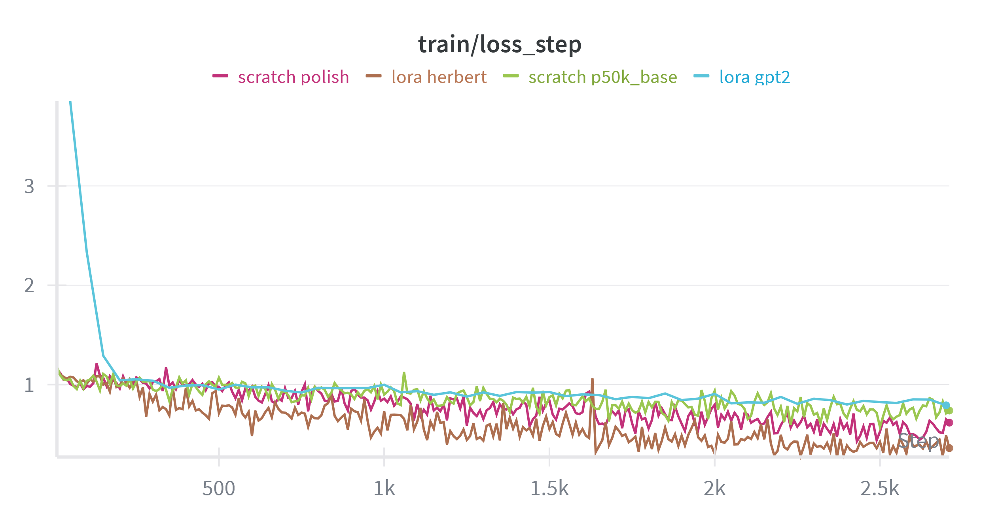
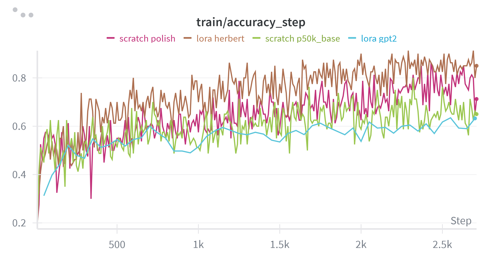
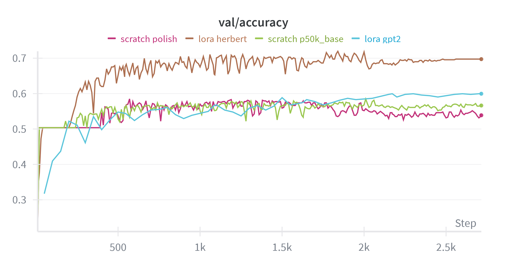
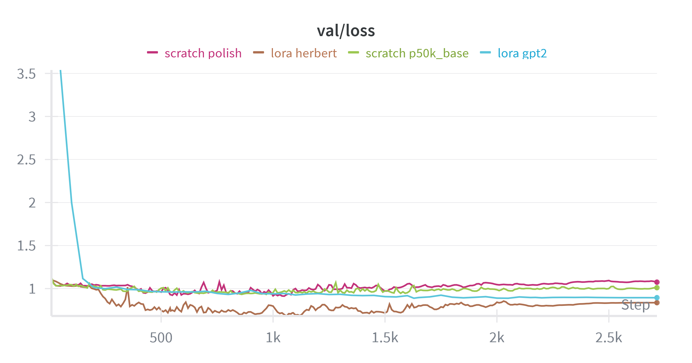
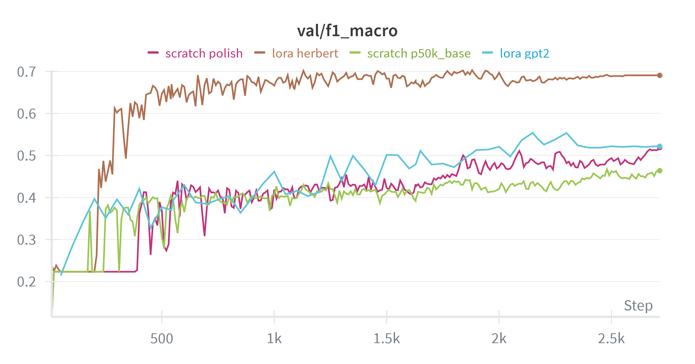

## Lab 3 - Fine-Tuning vs. From-Scratch Training for Text Classification

Autor: Bartosz Gacek

### Wstęp

Podobnie jak w poprzednich laboratoriach, proces trenowania modeli został przeprowadzony przy użyciu platformy `Runpod`. Konfiguracja sprzętowa pozostała bez zmian i obejmowała:

- GPU: `Nvidia A40`
- Pamięć RAM: 48 GB
- CPU: 9 vCPU

---

### Napotkane problemy i ich rozwiązanie

Pierwotna koncepcja zakładała wykorzystanie modelu `GPT2ForSequenceClassification` jako bazy do fine-tuningu, wraz z kompatybilnym tokenizerem. Niestety, wyniki uzyskane po wytrenowaniu tego modelu okazały się niezadowalające i, co zaskakujące, gorsze od rezultatów osiągniętych przez prosty model transformera trenowany od zera. Stało to w sprzeczności z oczekiwaniami przedstawionymi w instrukcji laboratoryjnej.

Analiza problemu doprowadziła do wniosku, że przyczyną niepowodzenia był niewłaściwy dobór modelu bazowego. Model GPT-2 został wytrenowany głównie na korpusach języka angielskiego, co sprawiło, że wzorce językowe, które przyswoił, nie miały bezpośredniego przełożenia na specyfikę języka polskiego, a w szczególności na polski slang młodzieżowy. Metoda fine-tuningu (w tym przypadku LoRA), modyfikująca jedynie niewielką część wag, okazała się niewystarczająca, aby model skutecznie nauczył się nowych, specyficznych dla języka polskiego zależności.

W związku z powyższym podjęto decyzję o zmianie modelu bazowego na model dedykowany dla języka polskiego – **Herbert** (`allegro/herbert-base-cased`). Decyzja ta okazała się trafna. Model ten osiągnął wyniki znacząco przewyższające poprzednie próby, deklasując również model trenowany od podstaw. Potwierdziło to kluczowe znaczenie doboru odpowiedniego modelu pre-trenowanego do języka docelowego zadania.

---

### Opis zbioru danych

Do eksperymentów wybrano zbiór danych **`jziebura/polish_youth_slang_classification`**, dostępny na platformie Hugging Face. Jest to zbiór służący do klasyfikacji sentymentu tekstów zawierających polski slang młodzieżowy. W trakcie analizy danych potwierdzono, że kolumna "tekst" nie zawiera pustych wartości.

- **Zadanie**: Klasyfikacja tekstu (sentyment).
- **Liczba klas**: 3.
- **Podział danych**: Zbiór podzielony na zestawy treningowy, walidacyjny i testowy.
- **Liczebność zbioru testowego**: 543 próbki.

**Dystrybucja klas (sentyment):**

| Klasa             | Liczba próbek | Udział procentowy |
| :---------------- | :------------ | :---------------- |
| **0** (Negatywny) | 1259          | 29.03%            |
| **1** (Neutralny) | 2219          | 51.16%            |
| **2** (Pozytywny) | 859           | 19.81%            |

**Przykłady z datasetu:**

1. _- Masz może lejsy, Damian? - Mam, ale ci nie dam, Furto!_
2. _- Siema mordo, skąd Gucio ma kase na te markowe ubrania? - Rzuca buchem od kilku tygodni._
3. _Rano koniecznie jest z cytryną woda, bo wczoraj był lekki melanż_

### Opis Modeli

W ramach laboratorium porównano dwa podejścia do treningu modeli językowych:

#### 1. Model trenowany od zera (From-Scratch)

Mały model typu **Decoder-only Transformer** (architektura GPT), zainicjalizowany losowymi wagami.

- **Architektura**: GPTLanguageModel (własna implementacja).
- **Konfiguracja**:
  - `block_size`: 128
  - `n_embd`: 56
  - `n_head`: 4
  - `n_layer`: 6
  - `dropout`: 0.1
  - `n_classes`: 3
- **Rozmiar modelu**: ~3.04 mln parametrów (13.08 MB).
- **Tokenizer**: Wykorzystano tokenizer z modelu `allegro/herbert-base-cased`.
- **Trening**: 5 epok, learning rate 3e-4, batch size 8.

#### 2. Model Fine-Tuned (LoRA)

Pretrenowany model **`allegro/herbert-base-cased`** (architektura BERT, Encoder-only), dostrojony do zadania klasyfikacji przy użyciu techniki **LoRA (Low-Rank Adaptation)**.

- **Model bazowy**: Herbert Base Cased (polski model językowy).
- **Metoda fine-tuningu**: LoRA (r=8, alpha=16, dropout=0.1). Pozwala to na trening jedynie niewielkiej liczby dodatkowych parametrów (adapterów), pozostawiając wagi modelu bazowego zamrożone.
- **Rozmiar modelu**: ~124.4 mln parametrów (474.73 MB).
- **Trening**: 5 epok, learning rate 2e-4, batch size 8.

---

### Ewaluacja i Wyniki

#### Przebieg treningu

Poniżej przedstawiono wykresy z procesu uczenia obu modeli (zalogowane w Weights & Biases).

**Legenda do wykresów:**

- **Różowa linia**: _scratch polish_ - Model from-scratch z tokenizerem Herbert (Główny model z raportu).
- **Pomarańczowa linia**: _lora herbert_ - Model fine-tuned Herbert (LoRA) (Główny model z raportu).
- **Zielona linia**: _scratch p50k_base_ - Model from-scratch z tokenizerem `p50k_base` (Eksperyment dodatkowy).
- **Niebieska linia**: _gpt2_ - Model fine-tuned GPT-2 (Nieudana próba opisana w sekcji "Napotkane problemy").

**Loss treningowy:**

**Dokładność (Accuracy) treningowa:**

**Metryki walidacyjne:**

#### Wyniki końcowe na zbiorze testowym

Ewaluacja została przeprowadzona na wydzielonym zbiorze testowym (543 próbki). Poniższa tabela przedstawia zestawienie wyników obu modeli.

| Metryka                     | Transformer (From-Scratch) | LoRA (Fine-Tuned Herbert) |
| :-------------------------- | :------------------------: | :-----------------------: |
| **Accuracy**                |           0.5985           |        **0.7145**         |
| **F1 (macro)**              |           0.4482           |        **0.6901**         |
| **F1 (weighted)**           |           0.5023           |        **0.7076**         |
| **Inference time (całość)** |         **0.27s**          |           0.64s           |
| **Time per sample**         |         **0.49ms**         |          1.18ms           |
| **Total parameters**        |         3,036,603          |        124,445,187        |
| **Model size**              |          13.08 MB          |         474.73 MB         |

---

### Analiza Porównawcza i Wnioski

1.  **Jakość klasyfikacji (Accuracy & F1)**:
    Model fine-tunowany (Herbert + LoRA) osiągnął znacząco lepsze wyniki (**71.45% accuracy**) w porównaniu do modelu trenowanego od zera (**59.85% accuracy**). Jeszcze większą różnicę widać w metryce F1 Macro (0.69 vs 0.45), co sugeruje, że Herbert lepiej radzi sobie z klasami rzadziej reprezentowanymi lub trudniejszymi przypadkami. Wynika to z faktu, że Herbert posiada już "wiedzę" o języku polskim zdobytą podczas pre-treningu na ogromnych korpusach, podczas gdy mały transformer musiał uczyć się wszystkiego od zera na stosunkowo niewielkim zbiorze danych slangu.

2.  **Efektywność obliczeniowa (Inference Time)**:
    Model trenowany od zera jest **ponad 2-krotnie szybszy** w inferencji (0.49ms vs 1.18ms na próbkę). Wynika to bezpośrednio z jego rozmiaru – ma on ok. 3 mln parametrów, w przeciwieństwie do 124 mln parametrów Herberta. Jest to klasyczny kompromis jakość vs szybkość/zasoby. Do prostych zastosowań, gdzie 60% skuteczności jest akceptowalne, mały model byłby znacznie tańszym rozwiązaniem.

3.  **Stabilność treningu**:
    Jak wspomniano w sekcji problemów, wybór odpowiedniego modelu bazowego jest kluczowy. GPT-2 (angielski) nie sprawdził się w zadaniu dla języka polskiego. Dopiero użycie polskiego modelu (Herbert) pozwoliło na skuteczne wykorzystanie transfer learningu. W krzywych lossu treningowego nie widać znaczących różnic między modelami. Różnica jest dopiero widoczna w metrykach na zbiorze walidacyjnym. Tutaj Herber znacząco wyprzedził pozostałe rozwiązania.

    _Uwaga dotycząca liczby epok_: Podczas wcześniejszych eksperymentów próbowano użyć większej liczby epok, jednak modele szybko zaczynały się przetrenowywać (overfitting). Z tego powodu trening został ograniczony do 5 epok. Wnioski o potencjalnych dalszych wzrostach dokładności wyciągane na podstawie trendów widocznych na wykresach mogą być zatem mylące, gdyż w rzeczywistości dłuższy trening prowadził do poprawy wyników jedynie na zbiorze treningowym.

4.  **Podsumowanie**:
    Eksperyment potwierdził przewagę fine-tuningu dużych modeli językowych nad trenowaniem małych modeli od zera w zadaniach NLP, szczególnie gdy dysponujemy ograniczonym zbiorem danych treningowych. Modele pre-trenowane oferują lepszą generalizację i rozumienie kontekstu językowego. Jednakże, małe dedykowane modele nadal mają swoje miejsce w systemach wymagających bardzo niskiej latencji lub działających na urządzeniach o ograniczonych zasobach, o ile akceptujemy niższą jakość predykcji.
